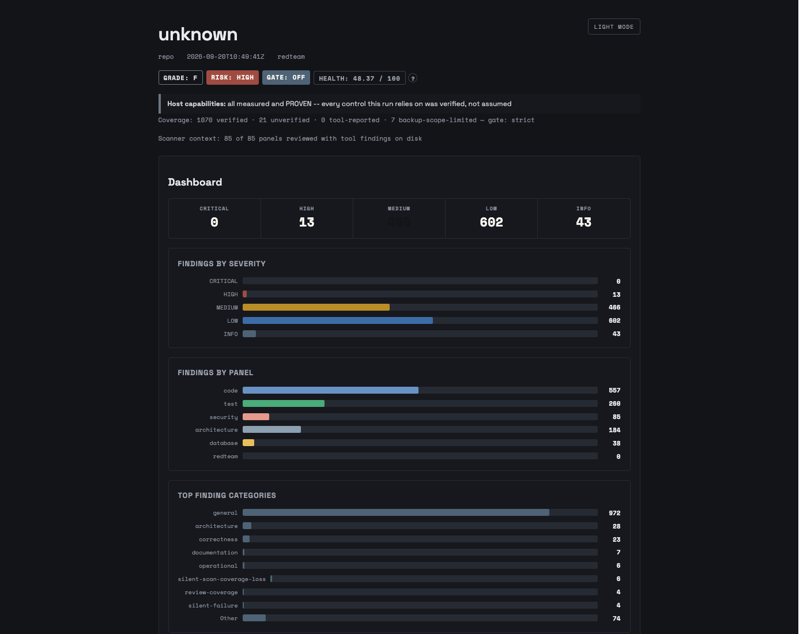

# Panopticon

A standards-cited code-review skill for AI coding agents. Point it at a repository and it profiles the code, groups it, fans out specialised reviewer agents in parallel, sends every claim that clears a verification floor to an independent advisor, grounds what it can in real static-analysis tools, and writes one validated `CodeReviewReport` with a health grade, a CI gate, and a citation for every finding.

It is free and open source (MIT) and it will stay that way.



*The dashboard of a real run: Panopticon reviewing its own repository, security mode `redteam`, with the scanner image on. The full readout and a findings excerpt are in [`docs/samples/`](docs/samples/README.md).*

New here? Read [Getting started](docs/GETTING-STARTED.md) first: what it does, what a run costs, how to run one, in two pages.

## What it does

- **Discovery → scout → fan-out → verify → synthesis.** A committed `panopticon.yml` at the repo root says how the code is grouped; a cheap scout per group picks the review domains; one reviewer runs per (domain, group) cell; every finding that clears the verification floor then goes to an independent advisor that confirms, rejects, or asks for more, and findings below the floor are published as `unverified` and do not grade or gate; synthesis dedupes, grades, and gates.
- **Standards-cited.** Findings are keyed to the ten domains of OCRDb, a fixed catalog of code-review finding codes that ships with the skill (security, correctness, architecture, testing, quality-maintainability, agentic-trust, data-and-persistence, production-readiness, accessibility, language-and-internationalization), and carry CWE, OWASP, SSVC and EPSS citations where they apply.
- **Tool-grounded when possible.** An optional Docker image runs Bandit, Semgrep, gitleaks, osv-scanner, Trivy, ESLint security, and language-specific SAST and dependency auditors (gosec, SpotBugs, Brakeman, bundler-audit, cargo-audit, dependency-check, a Roslyn analyzer; pip-audit and npm-audit only under `--online`). Tool findings go through the same verification as agent findings, and an unverified tool hit does not grade or gate. The one deliberate exception is `--security redteam`, where a CRITICAL or secret-class hit in an excluded path still blocks.
- **Honest about coverage.** A report says whether its coverage is certified, which host controls were proven rather than assumed, what was excluded, and why. The CI gate reads `INCONCLUSIVE` rather than `PASS` when gate-relevant coverage did not complete.
- **Resumable.** `driver loop` is a checkpointed state machine. A run that hits a session limit or a crash resumes where it stopped.

## Supported agent platforms

The skill uses the open `SKILL.md` format. Hosts are listed in the order we recommend them.

- `claude` — Claude Code. First-class and the reference host: parallel fan-out through the Agent tool. It claims all five run-time controls and ships a probe for each, including mediating every reviewer write to its declared output file; a run re-measures them and prints what was actually proven on your machine.
- `kimi` — enforced headless runner (`driver loop --host kimi`); every reviewer runs in a registered, tool-restricted shell with read and write guards in a per-run home. Kimi claims the same five controls and measures them with its own probes.
- `codex` — enforced headless runner (`driver loop --host codex`); scoped read tools and JSON-returning roles. Codex does not prove the write guard, so write-capable roles require the operator's explicit `--allow-unenforced`.
- `generic` — the sequential session-mode fallback for any host that reads `SKILL.md` and has no headless runner. Unenforced and disclosed as such. `gemini` is registered but retired as a selectable host; use `--host generic`.

The write guard is the control worth understanding before you adopt: on hosts that cannot mediate a reviewer's writes, a compromised or confused reviewer could write outside its output file. Panopticon measures this per host, refuses write-capable roles where it is unproven unless you accept that explicitly, and prints the posture on every report. See "Host capabilities" in [`docs/PANOPTICON.md`](docs/PANOPTICON.md).

## Installation

Everything runs from a checkout; there is no package to install. Python 3.11 or newer plus three libraries:

```bash
git clone https://github.com/panopticon-scanner/panopticon.git
cd panopticon
python3 -m pip install pyyaml defusedxml jsonschema
```

`driver` in the prose below means `python3 skill/scripts/driver.py`; every code block spells it out.

### Claude Code (recommended)

Symlink the skill into Claude's skills directory and register the enforcement shells once (re-run after template changes):

```bash
ln -s "$(pwd)/skill" ~/.claude/skills/panopticon
python3 skill/scripts/dispatch.py --emit-host-agents claude
```

Claude Code loads registered agents at session start, so open a fresh session after registering. Then either type `/panopticon` inside the repository you want reviewed, or drive the loop directly (see Quick start).

### The scanner image (optional, recommended)

The tool axis runs inside a Docker image named `panopticon-tools`. CI publishes it to GitHub Container Registry as a public package, so pulling it takes minutes and needs no login:

```bash
docker pull ghcr.io/panopticon-scanner/panopticon-tools:latest
docker tag ghcr.io/panopticon-scanner/panopticon-tools:latest panopticon-tools
```

`latest` moves with every push to `main` and a daily asset refresh. To pin what you reviewed with, pull by digest instead; the digest behind `latest` when this README was written was `sha256:b5250bf0723a5dd65b715e02e4d0f172764051ca466c44439b23df8de77be5ef`, and `docker image inspect` prints the one you have.

If you would rather build than pull, the build compiles several scanners from pinned sources and can take over an hour. It builds from the same pinned sources and hashes CI builds from; the published image additionally carries a freshly pinned vulnerability-data layer, so pull it when you can:

```bash
docker build -t panopticon-tools .
```

Without the image, `driver readiness` fails closed and says so; re-run with `--no-tools` to review agent-only. That choice is recorded in the report, so it is never silent.

### Kimi Code CLI

```bash
mkdir -p ~/.kimi/skills
ln -s "$(pwd)/skill" ~/.kimi/skills/panopticon
python3 skill/scripts/dispatch.py --emit-host-agents kimi   # --agents-dir only for a non-default agents directory
```

Invoke with `kimi /panopticon`, or `python3 skill/scripts/driver.py loop <target> --host kimi`. The guide's "Driver run-loop" section describes Kimi's headless contract (per-run credential home, read and write guards, MCP disabled in that home).

### OpenAI Codex CLI

```bash
mkdir -p ~/.agents/skills
ln -s "$(pwd)/skill" ~/.agents/skills/panopticon
python3 skill/scripts/dispatch.py --emit-host-agents codex
```

Invoke with `$panopticon`, select it from `/skills`, or run `python3 skill/scripts/driver.py loop <target> --host codex`. Codex is enforced-only: every reviewer launches through the registered shell, and the loop refuses up front when a role's shell is missing.

### Any other SKILL.md host

Symlink `skill/` wherever the host looks for skills and run with `--host generic`. Reviews run sequentially in session mode and the report discloses that no run-time control was proven.

## Quick start

From the root of the repository you want reviewed, with the skill checkout at `skill/` (or the absolute path you installed it to):

```bash
python3 skill/scripts/driver.py readiness .     # preflight: deps, image, host, resumable run
python3 skill/scripts/driver.py setup .         # one-time: proposes panopticon.yml.draft
python3 skill/scripts/driver.py loop .          # the whole review, resumable
```

Read `.panopticon/setup-report.md`, rename the draft to `panopticon.yml`, commit it, and the loop runs the committed matrix. Scope a review instead of running the whole repository:

```bash
python3 skill/scripts/driver.py loop . -f src/auth.py        # one file plus its tests and neighbours
python3 skill/scripts/driver.py loop . -d src/payments       # one directory
python3 skill/scripts/driver.py loop . -c                    # this branch vs its base
python3 skill/scripts/driver.py loop . -c --base release-2   # vs an explicit base
python3 skill/scripts/driver.py loop . --pr 217              # PR 217 in an isolated worktree
```

Useful flags: `--security redteam` for the adversarial security posture, `--fail-on high` to make the gate fail the build, `--tools` or `--no-tools`, `--max-budget-usd` and `--max-iterations` to bound spend, `--max-verify N` to cap the verification queue on large deltas. The full list is in [`docs/PANOPTICON.md`](docs/PANOPTICON.md), "Global flags".

## What a review costs

This is a multi-agent fan-out, so the first question is the right one. One measured data point, the run whose dashboard is above:

| Run 14 (2026-09-20) | |
|---|---|
| Target | this repository, 135 K lines of code |
| Mode | `--security redteam --tools`, Claude Code, default model profile: Opus domain-advisors, Sonnet panels, Haiku scouts and per-finding advisors |
| Matrix | 8 groups, 85 reviewer cells |
| Agent launches | 916 |
| Tokens | 481 M (430 M of them cache reads) |
| Cost reported by the host | about $633 |
| Wall clock | 24.5 h, of which roughly 9 h was waiting on session quota |
| Result | 1,124 findings kept (0 critical, 13 high), 1,079 of them confirmed; coverage certified |

That is the most expensive shape the tool has: adversarial mode, every tool, the largest model tier for verification, on a repository that is itself a scanner. Levers, in order of effect: scope (`-c`, `--pr`, `-d`), `--security standard`, `--max-verify`, a smaller advisor tier in the host's model profile, and `--max-budget-usd` on `driver loop` as the hard stop. Every report carries its own ledger under `meta.cost`, so your second run can be budgeted from your first.

## What you get

- `.panopticon/<run-tag>-report.json` (split into parts when large) and `.panopticon/<run-tag>-report.json.html`, plus a markdown summary on the terminal. The report validates against `skill/reference/report-schema.json`.
- `summary.gate` for CI: `PASS`, `FAIL`, `OFF` (no `--fail-on` given), or `INCONCLUSIVE` (coverage did not complete; treat as not certified).
- Cross-run reconcile: against the previous run's report, findings recur, close, arrive as new, or land in `ambiguous`, the fail-closed bucket a person has to adjudicate.
- Optional issue filing to GitHub from a finished report (`scripts/`), with severity, evidence and panel labels. GitHub is the only tracker supported.

The HTML report is a single file with no sibling assets. Attach it to a message, mail it, or drop it in a shared folder. It contains no telemetry; the only thing it fetches when opened is its web font from Google Fonts, and it renders correctly offline without it.

## Scope and non-goals

- One repository per run. Cross-repository roll-ups and estate views are out of scope for the skill.
- Filing goes to GitHub issues only. Other trackers are not planned.
- Periodic and on-demand review. Wiring the gate into a target repository's CI is possible (read `summary.gate` from the report, or call the synthesizer directly for its exit code) but the shipped workflows here scan this repository, not yours.
- No hosted service, no telemetry. Outbound calls are only the ones you ask for: your agent host; `--online`, which lets the dependency auditors reach their advisory endpoints through an allowlisting proxy; `synthesize --epss` for EPSS scores; GitHub, when you file issues from a finished report; and the image pulls. Everything else, the scanner containers included, runs with `--network none`.
- The reviewed tree is treated as hostile: it cannot select scanners, parsers, git hooks or filters, and reviewers read it under confinement. That is a design goal, not a claim of completeness.

## Repository layout

| Path | Purpose |
|------|---------|
| `skill/` | The installable skill surface — symlink THIS directory into your agent's skills dir |
| `skill/SKILL.md` | Skill entry point (frontmatter + quick reference) |
| `docs/GETTING-STARTED.md` | Two-page introduction: what it does, what it costs, how to run it |
| `docs/PANOPTICON.md` | Full user guide, driver run-loop spec, and schema contracts |
| `docs/samples/` | A real report's readout and screenshots |
| `skill/scripts/` | Runnable Python modules (driver, discovery, synthesizer, dispatch, tools) |
| `skill/agents/` | Custom agent definitions (`advisor`, `domain-advisor`, `domain-panel`, `scout`, `setup-scan`) |
| `skill/reference/` | Schemas, CWE catalog, security checklists, example group profiles |
| `scripts/` | Project maintenance, issue filing, and triage CLI scripts |
| `tests/` | pytest suite |
| `Dockerfile` | `panopticon-tools` scanner image |
| `Dockerfile.fixtures` | Test fixture image definition |
| `requirements-fixtures.txt` | Hash-pinned dependencies the fixture image installs (see DEVELOPMENT.md) |
| `requirements-tools.txt` | Hash-pinned closure the scanner image installs, `--require-hashes --no-deps` |
| `tools-image/node/` | `package.json` + `package-lock.json` the scanner image installs with `npm ci` |
| `tools-image/semgrep/` | Five checked local corrections and engine controls for the pinned Semgrep rules bundle, including exact JSON parser source boundaries |

## Development

See [DEVELOPMENT.md](DEVELOPMENT.md) for the architecture and the design decisions, [CONTRIBUTING.md](CONTRIBUTING.md) for the workflow, and [SECURITY.md](SECURITY.md) for reporting a vulnerability in the tool itself.

```bash
python3 -m pip install -e ".[dev]"      # test and lint dependencies only; the code runs from the checkout
python3 -m pytest tests/ -q
python3 -m ruff check skill/scripts/ tests/
```

Running the scanners locally, once the image exists:

```bash
python3 skill/scripts/run_tools.py --deps
```

## Maintenance

Panopticon has one maintainer. Design specs are drafted in a private companion repository; the as-built record that matters for using or changing the tool is public: `DEVELOPMENT.md`, `docs/`, and the issue tracker, where every self-scan finding is filed with its severity and evidence labels.

## License

[MIT](LICENSE)
